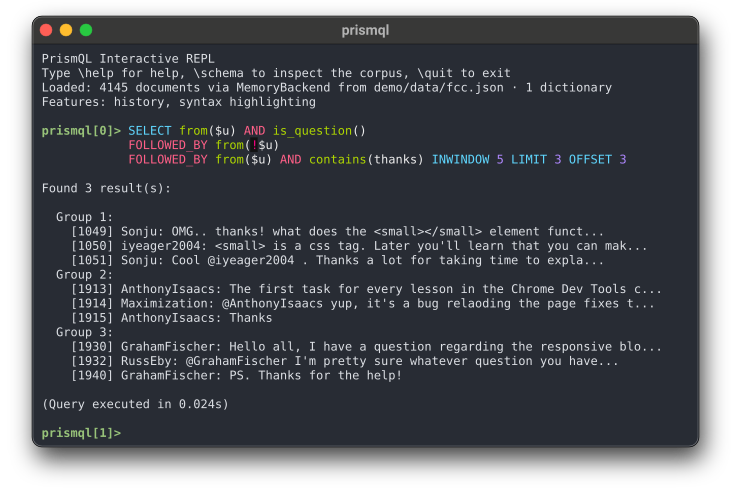
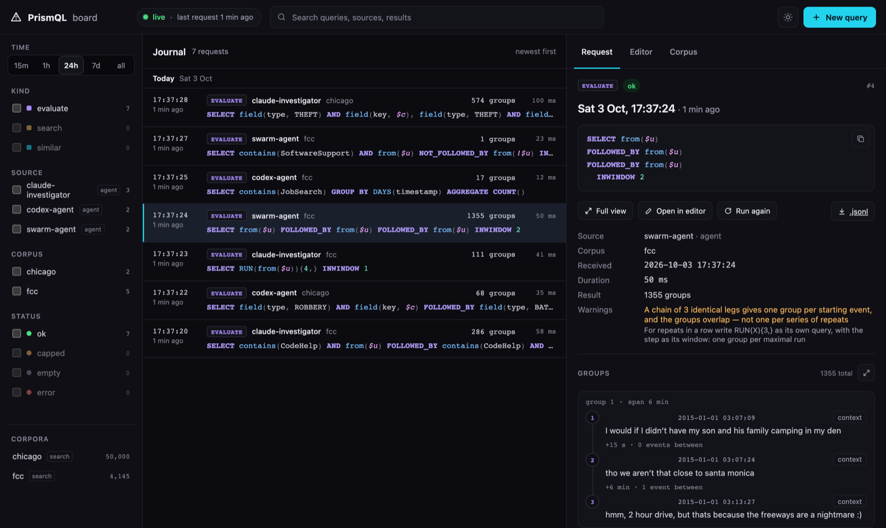
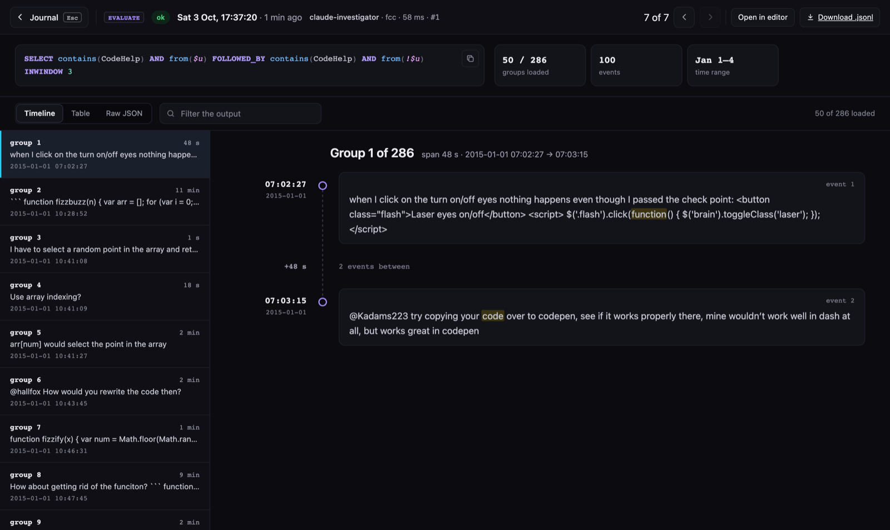
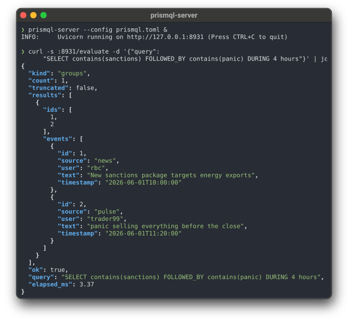

# PrismQL — pattern retrieval in ordered event data

PrismQL is a declarative language for finding **temporal and sequential
patterns** in ordered events — chat logs, agent traces, transactions, crime
records. You name a shape in the stream; it returns every instance of that
shape as the events themselves, grouped, never a summary.

<p align="center">
  
</p>

```prismql
SELECT field(type, ROBBERY) AND field(cell, $c)
       FOLLOWED_BY field(type, BATTERY) AND field(cell, $c) DURING 30 minutes
```
```
field(type, ROBBERY) and field(cell, $c) ~>(30m) field(type, BATTERY) and field(cell, $c)
```

The robbery-then-battery shape is the opening query of Zhu, Huang &
Chaudhuri, [*High-Performance Row Pattern Recognition Using
Joins*](https://www.vldb.org/pvldb/vol16/p1181-zhu.pdf), PVLDB 16(5),
2023 ([doi:10.14778/3579075.3579090](https://doi.org/10.14778/3579075.3579090)),
Figure 1, over the City of Chicago crime records
([data.cityofchicago.org, `ijzp-q8t2`](https://data.cityofchicago.org/Public-Safety/Crimes-2001-to-Present/ijzp-q8t2)).

Two surface dialects — classic `SELECT` and a pipe dialect — lower to one
intermediate representation and run through one operator layer, so the same
query means the same thing however it is written.

What the language gives you that a `WHERE` clause does not: ordered
sequences (`FOLLOWED_BY`, `PRECEDED_BY` and their negations, matched
*nearest-first*), unordered co-occurrence (`INWINDOW`), windows on either
axis — positions (`INWINDOW 5`) or wall clock (`DURING 30 minutes`) —
pattern variables (`$c`: the same value across legs; `!$c`: a different
one), quantifiers, runs (`RUN(X){7,}`: repeats in a row, one group per
run), and subqueries whose groups are themselves operands.

## What is in the repository

A language, and a few tools that carry a corpus to it:

```
your events ──prismql ingest──▶ one ordered stream ──▶ engine: REPL · Python · server ──▶ groups of events
```

| Part | What it does |
|---|---|
| **The language** | Predicates name sets of events: `field`, `from`, `contains`, `is_question()`, `similar_to("…", 0.7)`. Operators turn sets into groups: `FOLLOWED_BY`, `INWINDOW`, `DURING`, `RUN`. Two dialects, classic and pipe, parse to one intermediate representation and run through one operator layer over a Polars plan. |
| **Ingest** | `prismql ingest` turns a table, or a folder of Claude Code or Codex logs, into one stream: sorted, time in UTC. In the same pass it can add columns that predicates read: annotations (questions, links, mentions, named entities), an embedding per event, labels from a local decision model. |
| **Backends** | Answer "which events satisfy this predicate": `memory` by default, `tantivy` for a full-text index kept on disk. |
| **Server** | HTTP over one or more corpora. `/evaluate` runs the language. `/search` (full-text, BM25) and `/similar` (nearest by meaning) are scouting endpoints outside the language: they rank, to show what is where before you write a query. The board at `/board/` shows a person every request and the events that answered it. `prismql-mcp` puts it behind MCP. |
| **REPL** | `prismql`: the language at a prompt, over one file. |
| **Agent skill** | `skills/prismql/`: what an agent needs to query the server and investigate a question. |

At query time, search by meaning is the one part with a model behind it:
`similar_to()` in the language and `/similar` on the server compare the
query text with an embedding of each event, computed once — at ingest
(`--embed`) or when the server starts. The other models (named entities,
decision-model labels) run only at ingest, and what reaches the engine is
plain columns.

## Install

PrismQL is **not on PyPI**; `pip install prismql` does not work yet.
Straight from git, no clone and no virtualenv — this puts `prismql`,
`prismql-server` and `prismql-mcp` on your PATH:

```bash
uv tool install "prismql[repl,server,mcp] @ git+https://github.com/mechanicpanic/prismql"
```

The engine has no optional parts; extras add the tools around it. Take
the ones you use:

| Extra | For |
|---|---|
| `repl`, `highlighting` | the prompt, and colour in it |
| `server` | `prismql-server` and the board |
| `mcp` | `prismql-mcp`, the server behind MCP |
| `tantivy` | a full-text index kept on disk, behind text predicates and `/search` — the same answers, faster on a large corpus |
| `semantic` | `similar_to()` and `/similar`; a corpus that carries embeddings needs it to load |
| `ingest` | `prismql ingest --embed` |
| `nlp` | named entities at ingest (spaCy) |

Pin a commit for results that must not move — `…/prismql@<sha>`.
Python ≥ 3.12, no compiler and no Rust toolchain needed.

Or from a clone, if you want the examples and the references at hand:

```bash
git clone https://github.com/mechanicpanic/prismql.git && cd prismql
uv sync                    # engine only — polars and pyarrow are core, not extras
uv sync --extra repl --extra highlighting --extra server   # REPL and HTTP server
```

## Try it on your own events

One JSON object per line, any fields; `id` and a timestamp field are the only
ones the engine needs to know about:

```jsonl
{"id": "e1", "time": "2026-06-18T18:24:12Z", "kind": "save",   "page": "P1", "label": "A"}
{"id": "e2", "time": "2026-06-18T18:24:31Z", "kind": "delete", "page": "P1", "label": "Admin"}
{"id": "e3", "time": "2026-06-18T18:25:56Z", "kind": "save",   "page": "P1", "label": "A"}
```

```toml
# prismql.toml
[backend]
type = "memory"
data = "events.jsonl"
timestamp_fields = ["time"]   # parsed on load

[engine]
timestamp_field = "time"      # the axis DURING measures on
```

```
$ uv run prismql --config prismql.toml
prismql[0]> SELECT field(kind, delete) AND field(page, $p) FOLLOWED_BY field(kind, save) AND field(page, $p) DURING 10 minutes
Found 1 result(s):

  Group 1:
    [e2] ?:
    [e3] ?:

(Query executed in 0.123s)
prismql[1]> \schema        # fields, coverage, example values
prismql[2]> \quit
```

The answer is the group of ids. What follows each id is the REPL's one-line
preview, `user: text` — these events have neither field, so it prints `?:`
and nothing after it. Give your events a `user` and a `text` field and the
preview fills in; the match itself does not change.

Both `timestamp_*` keys are needed: without `[engine].timestamp_field` a
`DURING` query returns nothing rather than an error.

Have a table that is not quite in that shape, or a folder of Claude Code
transcripts? `prismql ingest table export.csv events.parquet --id rev_id --time
created --sort created` (or `prismql ingest claude-code ~/.claude/projects/<project>
sessions.parquet`, or `prismql ingest codex ~/.codex/sessions …`) writes the stream for you: sorted, timestamps parsed to UTC,
optionally with an embedding column (`--embed text`) the server reads instead
of encoding at start. Details in `docs/USER-GUIDE.md`, section 2.

## Where to go next

- **Query your own data, step by step** —
  [`docs/USER-GUIDE.md`](docs/USER-GUIDE.md): install, the config file, what
  your event file must look like, the first queries and the errors you will
  hit.
- **Run the server** — [`docs/SERVER.md`](docs/SERVER.md): extras, preparing
  a corpus (annotations, embeddings of your own or from elsewhere), every
  config key with its default, start-up time and memory, the board, restart.
- **Learn the language** — [`docs/MENTAL_MODEL.md`](docs/MENTAL_MODEL.md):
  two axes, three levels, twelve shapes to recognise on sight, with a
  self-test. One sitting. Exhaustive references: `LANGUAGE_REFERENCE.md`
  (classic) and `PIPE_REFERENCE.md` (pipe).
- **Let an agent query your data** —
  [`docs/AGENT-USE.md`](docs/AGENT-USE.md): start a server on your events and
  hand the agent the folder `skills/prismql/` — the language reference, how
  to call the server, and the mistakes agents actually make. `curl` against
  the server is the path it leads with, and it needs no MCP; the skill also
  documents a Python fallback for when no server is running. Copy that
  folder with symlinks resolved — `cp -RL skills/prismql <dest>` — because
  its `LANGUAGE_REFERENCE.md` is a symlink into the package and a plain
  `cp -R` leaves the copy dangling.
- **Investigate agent behaviour** — the skill's *Investigating* section
  (`skills/prismql/SKILL.md`): from a question to a finding with a null twin,
  question shapes on agent and web logs (spread to other agents, never
  cancelled, streaks per agent, answered by another address, bursts, per-day
  counts, lead-lag across streams), semantic fields labelled at ingest by a
  local decision model (`prismql ingest … --judge`), and the shapes that
  answer wrong today.
- **Work on the repository** — [`docs/START-HERE.md`](docs/START-HERE.md):
  the reading path, the gates, what the tests prove, how state is recorded.

## Human oversight: what the agents asked, and what came back

When agents query your data for you, the claim they bring back is a
summary. The board at `/board/` on the server is the other side: every
request any client sends, the query exactly as it ran, and the events that
answered it, so a person can check the evidence instead of the summary.

<p align="center">
  
</p>

- **Journal.** Every request, live, newest first: the client that sent it
  (agents name themselves with an `X-PrismQL-Client` header), the corpus,
  how many groups, how long it took. Filter by time, kind, client, corpus
  and status — ok, capped, empty, error.
- **Inspector.** The query highlighted, its outcome, and **warnings** for a
  query that runs without an error but asks another question than it
  seems to — above, an agent counted "the same user three times" with a
  chain of identical links, which yields 1,355 overlapping groups; the
  warning says so and points to `RUN`. Then the first groups, event by
  event; *context* on an event shows what surrounded it within ten minutes,
  from the same actor or from everyone.
- **Full view.** Every group as a timeline — the matched events, the time
  between them and how many events were skipped — or as a table, or raw
  JSON, with a filter over the output.
- **Act on it.** *Open in editor* to change the query, *Run again*, or
  download the whole result as `.jsonl`; the editor sends its requests as
  the client `board`, so a person's checks sit in the same journal as the
  agents' queries. With file output on, the journal survives a restart.

<p align="center">
  
</p>

The screenshots run on the demo corpora (freeCodeCamp chat, Chicago crime
records) with queries sent by three named agent clients.

## Server and agent integration

```bash
uv sync --extra server
uv run prismql-server --config prismql.toml     # POST /evaluate, GET /schema, GET /reference
```

`/board/` on the same server is a live feed of every request the server
answers — agents' and yours — with the query highlighted, the outcome, and an
editor to re-run or change any of it (summaries only; results stay where they
were). Beside `/evaluate` the server has two scouting endpoints that *do* rank:
`POST /search` (full-text, tantivy syntax, BM25) and `POST /similar`
(nearest events by embedding). They answer "what is where" before you write
a query; the language itself stays set-in, set-out. Both take `hydrate` and
`output: "file"` like `/evaluate`.

`prismql.toml` holds all the state — backend type, data file, dictionaries,
timestamp field, limits:

```toml
[server]
port = 8901
max_results = 50            # page size for a match or scout response
enable_reload = false       # POST /reload answers 403 while this is false
results_memory_mb = 256     # kept results, in-memory budget; oldest evicted first
scout_depth = 1000          # best hits /search and /similar keep

[backend]
type = "memory"             # .json / .jsonl / .csv / .parquet
data = "events.jsonl"
timestamp_fields = ["timestamp"]   # parsed on load

[engine]
timestamp_field = "timestamp"      # the axis DURING measures on
quantifier_ceiling = 10            # closes open ranges like {2,}

[dictionaries]
spikes = ["spike", "surge"]
```

Which section a key belongs to is load-bearing: the loader reads
`[backend]`, the engine reads `[engine]`, the HTTP layer reads `[server]`.
A key in the wrong section is ignored, not rejected.

`POST /evaluate` returns hydrated event groups; query errors come back as
structured 422s whose messages are written for an agent to self-correct.
A request may carry a `dictionaries` overlay — term lists merged over the
config ones for that query only — so an agent can iterate on the semantic
layer without touching server state. `GET /schema` describes the loaded
corpus (fields, coverage, example values) and is the thing to read before
writing queries against an unfamiliar corpus. Beyond one page, a match or
scout result is kept server-side under an opaque `result_id` and paged with
`GET /results/{result_id}` (or streamed whole with the `.jsonl` form,
which carries an `X-PrismQL-Total` header with the line count) instead of
re-run; both routes are rate-limited like `/evaluate`.
`AGGREGATE count()` still counts every group, uncapped.

MCP-native agents get a single `evaluate()` tool through a stdio shim:

```bash
uv sync --extra server --extra mcp
uv run prismql-mcp        # finds the server via PRISMQL_SERVER_URL (default :8901)
```

<p align="center">
  
</p>

## From Python

```python
from prismql import PrismQLEngine
from prismql.backends.memory import MemoryBackend

messages = [
    {"id": 1, "text": "my build is broken",        "user": "customer"},
    {"id": 2, "text": "can you help?",             "user": "customer"},
    {"id": 3, "text": "sure, what does the log say", "user": "support"},
    {"id": 4, "text": "try a clean reinstall",     "user": "support"},
    {"id": 5, "text": "that fixed it, thanks",     "user": "customer"},
]

engine = PrismQLEngine(search_backend=MemoryBackend(messages))
engine.add_dictionary("problem", ["broken"])
engine.add_dictionary("fix", ["reinstall"])

engine.execute("SELECT is_question()")
# [[2]]

engine.execute("SELECT from(customer) AND is_question()")
# [[2]]

# unordered: a question and a support message within 2 positions of each other
engine.execute("SELECT is_question(), from(support) INWINDOW 2")
# [[2, 3], [2, 4]]

# ordered: the problem, then the fix, within 5 positions
engine.execute("SELECT contains(problem) FOLLOWED_BY contains(fix) INWINDOW 5")
# [[1, 4]]

# the same query in the pipe dialect
engine.execute("contains(problem) ~> contains(fix) |> within(5)")
# [[1, 4]]

# the same user asks and is later heard from again
engine.execute("SELECT from($u) AND is_question() FOLLOWED_BY from($u) INWINDOW 4")
# [[2, 5]]

# how many, uncapped
engine.execute("SELECT contains(problem) FOLLOWED_BY contains(fix) INWINDOW 5 AGGREGATE count()")
# AggregateResult(value=1)
```

Results are lists of groups of message ids, in axis order within a group.

## How fast is it

The flagship query of Zhu, Huang & Chaudhuri's VLDB 2023 paper on
row-pattern recognition (PVLDB 16(5), Figure 1: robbery → battery → motor
vehicle theft, co-located, within 30 minutes) over the full City of
Chicago crime corpus — 8.47M events, 25 years — returns **372 matches**, in
exact agreement with the optimized SQL formulation, while the naive SQL join
does not finish in 90 minutes. The comparison against DuckDB, SQLite, Flink
`MATCH_RECOGNIZE`, ClickHouse and Elastic EQL is in
[docs/CHICAGO_BENCHMARK.md](docs/CHICAGO_BENCHMARK.md) — note that its
timing column was measured before the operator layer landed and still names
a Rust execution path that no longer exists.

Measured on the current engine, on a laptop: the same three-leg correlated
chain over the 1M-row tier of that corpus answers in **under half a second**
— 0.58 s on the first call, 0.42 s warm — for 28 matches, after a 5 s load.

## Query language, in brief

```
SELECT <conditions> [<sequence operators>] [INWINDOW n | DURING n unit]
       [AGGREGATE …] [GROUP BY …] [ORDER BY …] [LIMIT n]
```

**Predicates** name a set of events: `field(name, value)`, `from(user)`,
`contains(dict_name)`, `contains_phrase("…")`, `is_question()`,
`mentions_user(name)`, `mentions_date()`, `mentions_time()`,
`mentions_place()`, `mentions_org()`, `contains_link()`, `has_feature(f)`,
`similar_to("text", 0.7)`.

A bare name in `from(…)` or `contains(…)` must not collide with a grammar
keyword, and the time-unit abbreviations `s m h d w` are keywords:
`contains(h)` is a syntax error, `contains(hits)` is fine. There is no
quoting escape in that position — rename the dictionary, or reach the same
events through `field(user, "h")`, whose *value* does accept quotes.

**Booleans** compose sets, and only sets: `AND`, `OR`, `NOT`. An `AND`
between two already-grouped results is an error by design.

**Operators** turn sets into groups:

| | classic | pipe |
|---|---|---|
| near each other, any order | `A, B INWINDOW 5` | `A + B \|> within(5)` |
| then | `A FOLLOWED_BY B INWINDOW 5` | `A ~> B \|> within(5)` |
| before | `B PRECEDED_BY A INWINDOW 3` | `B <~ A \|> within(3)` |
| never followed by | `A NOT_FOLLOWED_BY B DURING 1 day` | `A !~> B \|> during(1d)` |
| on the clock | `A FOLLOWED_BY B DURING 10 minutes` | `A ~> B \|> during(10m)` |
| any 3 of A in a window | `A{3} INWINDOW 10` | `A{3} \|> within(10)` |
| 3+ in a row, one group per run | `RUN(A){3,} DURING 1 hour` | `run(A){3,} \|> during(1h)` |
| staged | `(SELECT A, B INWINDOW 3) FOLLOWED_BY (SELECT C) INWINDOW 8` | `[A + B \|> within(3)] ~>(8) [C]` |
| how many | `… AGGREGATE count()` | `… \|> count()` |

Three rules that catch everyone once: `INWINDOW` is **unordered** by
definition; the **last link of a chain must carry a window**, and one
trailing window distributes to every windowless link; `{n,}` has no upper
bound to enumerate to, so it is rejected unless you write `{n,m}` or set a
ceiling — `[engine] quantifier_ceiling` in `prismql.toml`, or
`PrismQLEngine(quantifier_ceiling=…)` from Python. `A{3}` is every
combination of three, not three in a row: for repeats use `RUN`.

**Pattern variables** hold an entity fixed across legs: `field(cell, $c)` on
two legs means "the same cell"; `field(cell, !$c)` means "a different one".
The equality is decided while choosing the nearest candidate, not after it,
so a stranger in between does not lose you the group.

Full grammar, every clause and every error message: `LANGUAGE_REFERENCE.md`
(classic) and `PIPE_REFERENCE.md` (pipe). Only the classic reference is
shipped inside the package, so `GET /reference` and the MCP
`prismql://reference` resource serve that one; read the pipe reference from
the repository.

## Backends, and which ones can do sequences

"Backend" here means only the search layer — *give me the id set for this
predicate*. Sequence and window operators need something else on top: an
**order axis**, the column that says where an event sits in the stream.
Stream order is load order; ids are labels, never coordinates.

| backend | text modes | order axis | sequence operators |
|---|---|---|---|
| `memory` | stem (default) / token / substring | yes | yes |
| `tantivy`, built or opened from `index_path` | stem (default) / token; ranked scouting | yes (kept on disk) | yes |
| `rust_memory` (optional crate) | token / substring | yes | yes |

That is the whole list. A database or a search cluster is not a backend:
make a table out of it, `prismql ingest` it, and the engine reads the
Arrow stream — the engine never joins and never reconstructs order from id
values. A backend without an order axis (a tantivy index built before the
axis sidecar existed) refuses sequence operators loudly. The backend raises
`PositionalUnsupportedError`; `engine.execute()` wraps everything a query
raises, so what reaches a caller of the public API is a
`PrismQLRuntimeError` carrying the original as `__cause__` and as
`details["cause_type"]`. Catch `PrismQLRuntimeError` — an
`except PositionalUnsupportedError` around `engine.execute()` does not fire.
Boolean and set queries still run on all of them.

```python
from prismql import PrismQLEngine
from prismql.backends.tantivy import TantivyBackend

backend = TantivyBackend(documents, index_path="idx/chat", timestamp_fields=["time"])
engine = PrismQLEngine(backend, timestamp_field="time")
engine.execute("SELECT contains(errors) AND from(deploy-bot)")
# next start: TantivyBackend(index_path="idx/chat") — no rebuild, axis included
```

To write your own, implement four methods of `SearchBackend`:

```python
from collections.abc import Sequence
from prismql.backends.base import SearchBackend
from prismql.types import MessageId

class MyBackend(SearchBackend):
    def search_text(self, terms: Sequence[str], field: str = "text",
                    operator: str = "OR") -> set[MessageId]: ...
    def search_by_field(self, field: str, value: str,
                        exact: bool = True) -> set[MessageId]: ...
    def get_total_documents(self) -> int: ...
    def get_all_document_ids(self, limit: int | None = None) -> set[MessageId]: ...
```

Override `has_order_axis()` and the `positions` / `sorted_positions` /
`ids_at` / `timestamps_at` group if your store can answer where an event
sits; leave them alone and sequence operators will refuse loudly.

## Dictionaries and precomputed features

Dictionaries are named term lists resolved by `contains(name)`. They live in
`prismql.toml` under `[dictionaries]`, are added at runtime with
`engine.add_dictionary(name, terms)`, or ride along with a single server
request. Single words match stemmed whole words by default (`fail` finds
`failed`; the stemmer's language is `text_language`, `english` unless set);
`match = "token"` or `"substring"` per dictionary, or `text_match` per corpus,
choose otherwise, and a backend that cannot honour the mode refuses instead of
answering differently.

Entity predicates — `mentions_org()`, `mentions_date()`, `mentions_place()`,
`mentions_time()`, `contains_link()`, `has_feature(f)` — need features
computed somewhere first; without an index behind them they raise a
teachable error naming the missing label rather than quietly returning
nothing. (`is_question()` is the exception: it works out of the box.) The
engine does not care where the features came from — spaCy, an LLM, human
annotation, your own rules — only which messages have which:

```python
from prismql.backends.base import PrecomputedIndexes

indexes = PrecomputedIndexes(
    entities={"DATE": {1, 5, 12}, "ORG": {3, 7, 15}},
    questions={2, 5, 9, 14},
    custom_features={"escalation": {4, 11}},   # queried with has_feature(escalation)
)
engine = PrismQLEngine(search_backend=backend, precomputed_indexes=indexes)
```

## Development

```bash
uv sync --extra server --extra repl --extra highlighting --extra tantivy --extra mcp
make check            # the whole gate: ruff format, ruff check, mypy, pytest
make check-fast       # the same, skipping the tests marked slow
make format           # ruff format + ruff check --fix
```

CI runs `make check` on Python 3.12 and 3.13. Everything else a contributor
needs — the reading path, what the ~1,400 tests actually prove, the oracles
behind the operator layer, the conventions — is in
[`docs/START-HERE.md`](docs/START-HERE.md) and `AGENTS.md`.

## Status

`0.1.0`, unreleased and not published anywhere. The engine is complete for
the operators documented above and every one of them runs through a single
operator layer over a Polars plan (`src/prismql/plan/`); the class of bug
this project treats as a release blocker — a query that runs without error
and returns a wrong or empty answer — is pinned by contract tests.
`STATE.md` is the current state of everything: shipped, decided, open.

## License

MIT — see `LICENSE`. PrismQL descends from the query language of the Chat
Corpora Annotator project and uses ANTLR4 for parsing the classic dialect.
